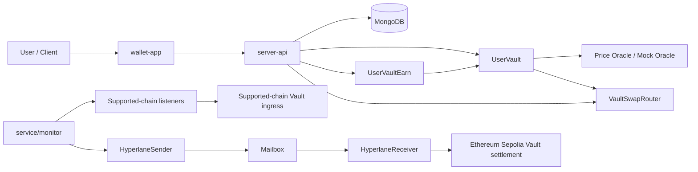
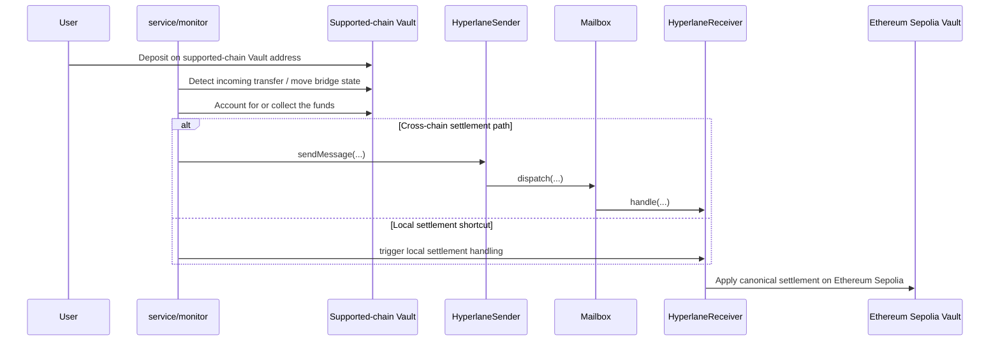

## Author

**Wan** / Email -> tekwei82 # hotmail.com (replace # with @)

Highly experienced .NET Full-Stack / Backend Developer with strong blockchain development experience, focused on Web3 infrastructure, vault settlement systems, multichain payment architecture, smart contract design / integrations, and scalable backend application development.

- Demo Site -> <a href="https://wallet.nexstack.xyz" target="_blank">https://wallet.nexstack.xyz</a>
- Token Faucet -> <a href="https://wallet.nexstack.xyz/faucet" target="_blank">https://wallet.nexstack.xyz/faucet</a>
- Card Payment Simulator -> <a href="https://wallet.nexstack.xyz/payment-test" target="_blank">https://wallet.nexstack.xyz/payment-test</a>


### Demo Account

- Demo User -> tekwei9@hotmail.com
- Password -> 12345678Aa


> This repository is built for research, architecture demonstration, and Web3 engineering portfolio purposes.

# Crypto Payment Wallet # Ether.fi wallet clone

<p align="center">
  <strong>A multichain testnet Vault Wallet sample that uses Ethereum Sepolia as the canonical settlement layer.</strong>
</p>

<p align="right">
  <a href="./README.md">English</a> | <a href="./README.zh-CN.md">简体中文</a>
</p>

<p align="center">
  <!-- Optional: replace OWNER/REPO when you add a CI workflow -->
  
  
  
  
  
  
  
  
</p>

<p align="center">
  <a href="#overview">Overview</a> ·
  <a href="#core-features">Features</a> ·
  <a href="#architecture">Architecture</a> ·
  <a href="#project-layout">Project Layout</a> ·
  <a href="#quick-start">Quick Start</a> ·
  <a href="#configuration">Configuration</a> ·
  <a href="#usage-examples">Usage</a> ·
  <a href="#deployment-flow">Deployment</a> ·
  <a href="#verification-and-testing">Testing</a> ·
  <a href="#contributing">Contributing</a>
</p>

## Overview

`Crypto Payment Wallet` is a testnet wallet sample centered on **vault addresses, cross-chain deposit handling, asset display, swap, earn, card-payment simulation, and transaction tracking**.

The repository is organized into four main parts:

- `contracts/` — Vault, cross-chain messaging, earn, swap router, test tokens, and mock oracles
- `server-api/` — Authentication, dashboard, transactions, earn, cards, faucet, FX, swap, vault, and notification backend modules
- `service/` — Deployment scripts, bridge monitor, and seed/simulation scripts
- `wallet-app/` — Next.js frontend wallet application

> [!IMPORTANT]
> **Any deposit on a supported chain will ultimately bridge or settle to the vault address on Ethereum Sepolia for canonical settlement.**
>
> This means:
>
> - `Base Sepolia`, `Arbitrum Sepolia`, `Optimism Sepolia`, `Scroll Sepolia`, and `Ethereum Sepolia` are **ingress chains / execution contexts**, not fully isolated long-term custody domains
> - Deposits must always match the **chain**, **token**, and **vault address**
> - Mainnet assets must never be sent to testnet addresses
> - All README text, UI copy, and operations documentation should treat the **Ethereum Sepolia Vault** as the canonical settlement target

## Core Features

- Deterministic vault-address flow based on email + salt
- Multichain deposit ingestion with **Ethereum Sepolia as the canonical settlement chain**
- Testnet asset handling for **ETH / USDT / USDC / WETH**
- Vault valuation, transaction history, notification center, and dashboard summary
- Vault-side asset conversion (`Swap`)
- Vault-side earn flows: subscribe, redeem, and claim rewards
- JWT-based authentication, request context, rate limiting, CORS, and error observability
- Bridge monitor, deploy scripts, and seed/simulation scripts
- Clean separation between contracts, backend, monitor, and frontend for future multisig, audit, CI/CD, and source verification work

## Security and Risk Notes

> [!WARNING]
> **Canonical settlement rule:** any deposit on a supported chain ultimately bridges or settles to the vault address on Ethereum Sepolia.
>
> Treat this as a product-level rule, not an implementation detail:
>
> 1. A user can send assets to a supported-chain vault or ingress address
> 2. The system may then observe the transfer, account for it, relay a message, and settle it on the canonical target chain
> 3. The final asset, settlement, and operational semantics are defined by the **Ethereum Sepolia Vault Address**

> [!CAUTION]
> This repository is a **testnet-only** project. Assets on `Sepolia`, `Base Sepolia`, `Arbitrum Sepolia`, `Optimism Sepolia`, and `Scroll Sepolia` must not be treated as production-value assets. Do not reuse mainnet keys and do not send mainnet funds.

> [!WARNING]
> The current design still includes a noticeable centralized control plane:
>
> - Sensitive vault actions are owner/backend controlled
> - Some critical addresses are injected through `.env`
> - Before production use, add multisig ownership, role separation, pause controls, timelocks, oracle freshness checks, stricter integration tests, audits, and source verification

## Architecture



## Why This Design

### Clear security boundaries

- Vault, receiver, earn, and swap paths use explicit privileged operations
- Receiver-side validation is designed around trusted mailbox / trusted sender / supported token controls
- Bridge and transaction processing can be reasoned about as state transitions rather than ad hoc side effects

### Modular repo layout

- Smart contracts, API, monitor, and frontend live in separate directories
- `chainConfig.js` centralizes chain, token, RPC, oracle, and Hyperlane settings
- Backend modules are split by business surface: `auth`, `vault`, `swap`, `earn`, `cards`, `transactions`, `notifications`, `faucet`, `fx`, and more
- Frontend API client and store are isolated from page components

### Upgrade-friendly boundaries

This repository is **not** using a proxy-upgrade architecture today, but it already has upgrade-friendly boundaries:

- Vault / Sender / Receiver / Earn / Router are independent units
- Address wiring is largely configuration-driven
- Ownership and governance can be upgraded later without redesigning the entire repo shape

### Operational and gas efficiency

- Deterministic deployment and clear responsibility boundaries reduce repeat deployment work
- Valuation logic is concentrated instead of duplicated everywhere
- Routing and settlement contracts remain intentionally lightweight

### Testability and auditability

- The backend already includes Jest + Supertest coverage
- `.env.sample` files make bootstrap expectations explicit
- The money-moving path is concentrated in `contracts/`, `service/monitor.js`, and `server-api/modules/*`
- The repo is structured in a way that supports threat modeling, privilege review, and fund-flow tracing

## Project Layout

| Path | Purpose | Primary language |
| --- | --- | --- |
| `contracts/` | Core onchain contracts | Solidity |
| `contracts/UserVault.sol` | Main vault contract | Solidity |
| `contracts/HyperlaneSender.sol` | Source-chain message dispatch | Solidity |
| `contracts/HyperlaneReceiver.sol` | Target-chain message handling and validation | Solidity |
| `contracts/UserVaultEarn.sol` | Earn accounting and reward flows | Solidity |
| `contracts/VaultSwapRouter.sol` | Vault-side swap execution | Solidity |
| `contracts/MockOracle*.sol` | Test oracle contracts | Solidity |
| `contracts/USDTx.sol`, `USDCx.sol`, `WETH.sol` | Test tokens | Solidity |
| `server-api/` | Express + Mongoose backend | JavaScript |
| `server-api/modules/*` | Business modules and route handlers | JavaScript |
| `server-api/tests/*` | Backend tests | JavaScript |
| `service/monitor.js` | Bridge monitor and state progression | JavaScript |
| `service/deploy-*.js` | Deploy scripts | JavaScript |
| `service/scripts/*` | Seed and simulation scripts | JavaScript |
| `wallet-app/src/app/*` | App routes and page UI | TypeScript / TSX |
| `wallet-app/src/lib/*` | API client, utilities, shared types | TypeScript |
| `wallet-app/src/store/*` | Auth and app state | TypeScript |

## Quick Start

### Prerequisites

Recommended versions:

- Node.js `>= 20`
- npm `>= 10`
- MongoDB `>= 6`
- A private key for testnet deployment and interaction
- RPC access for `Ethereum Sepolia`, `Base Sepolia`, `Arbitrum Sepolia`, `Optimism Sepolia`, and `Scroll Sepolia`

### Install dependencies

```bash
# backend API
cd server-api
npm ci

# bridge + deploy scripts
cd ../service
npm ci

# frontend
cd ../wallet-app
npm ci
```

### Configure environment variables

```bash
cp server-api/.env.sample server-api/.env
cp service/.env.sample service/.env
cp wallet-app/.env.sample wallet-app/.env.local
```

### Compilation note

> [!IMPORTANT]
> The current uploaded repository does **not** include `foundry.toml` or `hardhat.config.*`.
>
> In practice this means:
>
> - you can deploy with Ethers-based scripts
> - but you still need an external compilation workflow to produce `USER_VAULT_BYTECODE`
> - that bytecode must then be injected into `.env`

### Optional standardized build path

```bash
curl -L https://foundry.paradigm.xyz | bash
foundryup

# after adding foundry.toml
forge build
forge test
```

### Run tests

```bash
cd server-api
npm test
```

### Start the local development environment

```bash
# terminal 1
cd server-api
node server.js

# terminal 2
cd service
node monitor.js

# terminal 3
cd wallet-app
npm run dev
```

Default local endpoints:

- API: `http://localhost:3000`
- Frontend: `http://localhost:3001`

## Configuration

### Environment variables

#### `server-api`

| Variable | Required | Purpose |
| --- | --- | --- |
| `PORT` | No | API port, default `3000` |
| `MONGO_URI` | Yes | MongoDB connection string |
| `SIGNER_ADDRESS` | Yes | Backend signer / controlled address |
| `PRIVATE_KEY` | Yes | Backend signer private key |
| `FACTORY_ADDRESS` | Yes | CREATE2 deployer / factory address |
| `USER_VAULT_BYTECODE` | Yes | `UserVault` creation bytecode |
| `EARN_CONTRACT_ADDRESS` | No | Earn contract address |
| `CARD_PAYMENT_SETTLEMENT_ADDRESS` | No | Card settlement address |
| `JWT_SECRET` | Yes | JWT signing secret |
| `JWT_EXPIRES_IN` | No | JWT lifetime, default `12h` |
| `JWT_ISSUER` | No | JWT issuer |
| `JWT_AUDIENCE` | No | JWT audience |
| `INTERNAL_API_KEY` | No | Internal management auth |
| `CORS_ALLOWED_ORIGINS` | No | Allowed frontend origins |
| `CORS_ALLOW_ALL` | No | Whether all origins are allowed |

#### `service`

| Variable | Required | Purpose |
| --- | --- | --- |
| `MONGO_URI` | Yes | MongoDB connection string |
| `SIGNER_ADDRESS` | Yes | Monitor signer address |
| `PRIVATE_KEY` | Yes | Monitor signer private key |
| `FACTORY_ADDRESS` | Yes | CREATE2 deployer address |
| `USER_VAULT_BYTECODE` | Yes | Vault creation bytecode |
| `HYPERLANE_RECEIVER_ADDRESS` | Yes | Ethereum Sepolia receiver address |

#### `wallet-app`

| Variable | Required | Purpose |
| --- | --- | --- |
| `NEXT_PUBLIC_API_BASE_URL` | Yes | Backend API base URL |
| `NEXT_PUBLIC_EARN_CONTRACT_ADDRESS` | No | Frontend earn contract address |

### Networks and roles

| Network | Chain ID | Role | Notes |
| --- | --- | --- | --- |
| Ethereum Sepolia | `11155111` | **Canonical settlement chain** | Vault initialization, valuation, and settlement semantics |
| Base Sepolia | `84532` | Supported ingress chain | Deposits may be observed and settled to canonical Sepolia |
| Arbitrum Sepolia | `421614` | Supported ingress chain | Deposits may be observed and settled to canonical Sepolia |
| Optimism Sepolia | `11155420` | Supported ingress chain | Deposits may be observed and settled to canonical Sepolia |
| Scroll Sepolia | `534351` | Supported chain / special path | Still treated as part of Sepolia settlement semantics |

### Address conventions

| Item | Meaning |
| --- | --- |
| `FACTORY_ADDRESS` | CREATE2 public deployer / factory |
| `HYPERLANE_RECEIVER_ADDRESS` | Ethereum Sepolia-side receiver / settlement ingress |
| `hyperlane.Sender` | Sender contract address on supported chains |
| `Mailbox` | Per-chain Hyperlane mailbox |
| `Vault Address` | User-facing vault address; canonical settlement semantics still point to Ethereum Sepolia |

## Usage Examples

### Resolve a user vault address

```bash
curl -X POST http://localhost:3000/api/getVault \
  -H "Content-Type: application/json" \
  -d '{
    "email": "alice@example.com",
    "chainId": 11155111
  }'
```

### Deposit ERC-20 on a supported-chain vault

> [!WARNING]
> This action only sends tokens to the supported-chain vault address.
> The **business settlement meaning** of this deposit is still:
> **supported-chain deposit -> canonical vault settlement on Ethereum Sepolia.**

```bash
export BASE_SEPOLIA_RPC_URL="https://sepolia.base.org"
export PRIVATE_KEY="0xyourprivatekey"
export USDT_ADDRESS="0xAe7687fAe0D59Fc722564FA0e39885d5C43a3276"
export VAULT_ADDRESS="0xYourVaultAddress"

cast send $USDT_ADDRESS \
  "transfer(address,uint256)" \
  $VAULT_ADDRESS \
  1000000 \
  --rpc-url $BASE_SEPOLIA_RPC_URL \
  --private-key $PRIVATE_KEY
```

### Deposit native ETH on a supported chain

```bash
export OP_SEPOLIA_RPC_URL="https://sepolia.optimism.io"
export VAULT_ADDRESS="0xYourVaultAddress"

cast send $VAULT_ADDRESS \
  --value 0.01ether \
  --rpc-url $OP_SEPOLIA_RPC_URL \
  --private-key $PRIVATE_KEY
```

### Login

```bash
curl -X POST http://localhost:3000/api/auth/login \
  -H "Content-Type: application/json" \
  -d '{
    "email": "alice@example.com",
    "password": "strong-password"
  }'
```

### Quote a swap

```bash
curl -X POST http://localhost:3000/api/swap/quote \
  -H "Content-Type: application/json" \
  -H "Authorization: Bearer <JWT_TOKEN>" \
  -d '{
    "fromSymbol": "USDT",
    "toSymbol": "USDC",
    "amount": "25"
  }'
```

### Execute a swap

```bash
curl -X POST http://localhost:3000/api/swap \
  -H "Content-Type: application/json" \
  -H "Authorization: Bearer <JWT_TOKEN>" \
  -d '{
    "fromSymbol": "USDT",
    "toSymbol": "WETH",
    "amount": "25"
  }'
```

### Subscribe to Earn

```bash
curl -X POST http://localhost:3000/api/earn/subscribe \
  -H "Content-Type: application/json" \
  -H "Authorization: Bearer <JWT_TOKEN>" \
  -d '{
    "token": "USDC",
    "amount": "100"
  }'
```

## API Overview

| Module | Representative endpoints | Purpose |
| --- | --- | --- |
| Auth | `/api/auth/register`, `/api/auth/login`, `/api/auth/me`, `/api/auth/change-password` | User identity and session management |
| Dashboard | `/api/dashboard/summary` | Account overview |
| Vault | `/api/getVault`, `/api/withdraw` | Resolve vault addresses and withdraw |
| Swap | `/api/swap/quote`, `/api/swap` | Quote and execute vault-side conversion |
| Earn | `/api/earn/summary`, `/api/earn/history`, `/api/earn/subscribe`, `/api/earn/redeem`, `/api/earn/claim` | Earn workflows |
| Transactions | `/api/transactions/history`, `/api/transactions/:id` | Transaction history and detail |
| Cards | `/api/cards`, `/api/cards/payments`, `/api/cards/:id/freeze` | Card management and payment simulation |
| Faucet | `/api/faucet/status`, `/api/faucet/claim` | Test asset faucet |
| Notifications | `/api/notifications` | Notification center |

## Deployment Flow



### Pre-deployment checklist

- Prepare all `.env` files
- Confirm `FACTORY_ADDRESS`
- Prepare `USER_VAULT_BYTECODE`
- Confirm `HYPERLANE_RECEIVER_ADDRESS`
- Confirm chain configuration and RPC connectivity
- Confirm enough testnet gas on all participating chains

### Recommended deployment sequence

1. Deploy test tokens and mock oracles
2. Configure token and oracle addresses in `chainConfig.js`
3. Prepare the CREATE2 deployer / factory used by `UserVault`
4. Populate `USER_VAULT_BYTECODE`
5. Deploy and initialize `HyperlaneSender`
6. Deploy `HyperlaneReceiver`
7. Configure trusted mailbox, trusted sender, and supported token rules on the target side
8. Deploy `UserVaultEarn`
9. Deploy `VaultSwapRouter`
10. Start `monitor.js`
11. Create test vaults through `/api/getVault` or seed scripts
12. Run supported-chain deposit tests and verify final settlement semantics on **Ethereum Sepolia**

> [!IMPORTANT]
> A completed deployment does **not** mean every supported chain independently holds the final user balance semantics.
> The product, operations, support, audit, and README wording should all remain:
> **supported-chain deposits canonically settle to the Ethereum Sepolia vault address.**

## Recommended Visual Assets

If you want the README to feel like a polished open-source project page, add these visual assets:

```markdown
## Screenshots

KIV

```

## Verification and Testing

### Contract verification

Recommended strategy:

- Prefer source verification with preserved metadata and exact compiler settings
- Aim for exact-match verification where possible
- Mirror verification to explorers after source-based verification is reproducible

Example:

```bash
forge verify-contract \
  0xYourContractAddress \
  contracts/UserVault.sol:UserVault \
  --chain sepolia \
  --etherscan-api-key $ETHERSCAN_API_KEY
```

### Current test path

```bash
cd server-api
npm test
```

### Recommended additional test matrix

- Contract unit tests: Vault / Receiver / Sender / Earn / Router
- Integration tests: supported-chain deposit -> monitor -> Sepolia settlement
- Failure recovery: invalid sender, invalid mailbox, insufficient balance, retry path
- Oracle tests: wrong address, stale feed, abnormal price input
- Load tests: batch scanning, batch deposits, notification fan-out

## Contributing

Contributions are welcome across code, tests, docs, threat modeling, and audit feedback.

### Branch naming

- `main` — stable branch
- `feat/*` — features
- `fix/*` — fixes
- `docs/*` — documentation changes
- `test/*` — testing work

### Commit style

Conventional Commits are recommended:

```bash
feat(vault): add sepolia settlement warning
fix(monitor): handle mailbox validation edge case
docs(readme): clarify supported-chain settlement behavior
test(earn): add claim flow coverage
```

### Pull request checklist

- [ ] Tests pass
- [ ] README and configuration docs are updated
- [ ] Network/address notes are updated if deployment changes
- [ ] Supported-chain -> Sepolia settlement semantics are still validated
- [ ] Security-sensitive changes include risk notes

## License

**MIT** is the recommended repository-wide license because it matches the expectations of most open-source Web3 example projects.

If you choose a different license, keep the root `LICENSE` file, subpackage metadata, and README wording aligned.