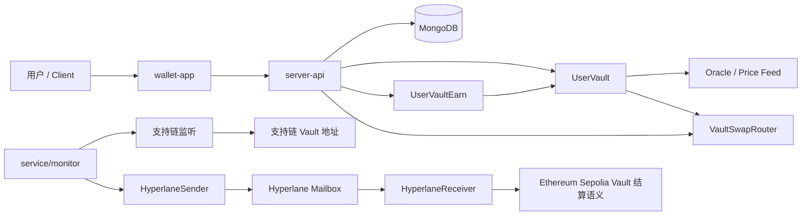
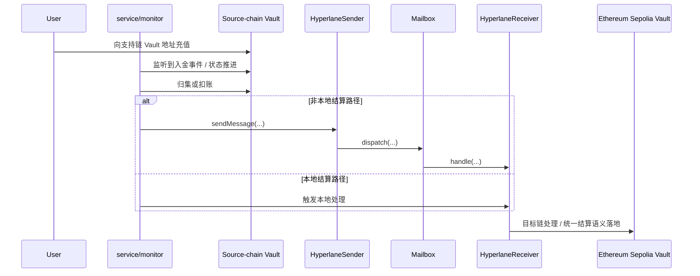

## 作者

**Wan** / Email -> tekwei82 # hotmail.com（请将 # 替换为 @）

拥有丰富开发经验的 .NET 全栈 / 后端开发者，专注于 区块链、Web3 基础设施、多链支付架构、Vault 统一结算系统、智能合约整合，以及可扩展后端应用开发。

### 演示账号

- Demo User -> tekwei9@hotmail.com
- Password -> 12345678Aa

- 演示网站 -> <a href="https://wallet.nexstack.xyz" target="_blank">https://wallet.nexstack.xyz</a>
- Token 水龙头 -> <a href="https://wallet.nexstack.xyz/faucet" target="_blank">https://wallet.nexstack.xyz/faucet</a>
- 卡支付模拟 -> <a href="https://wallet.nexstack.xyz/payment-test" target="_blank">https://wallet.nexstack.xyz/payment-test</a>


> 本仓库主要用于 Web3 技术研究、架构展示与工程作品集用途。

# Crypto Payment Wallet # Ether.fi wallet clone


<p align="center">
  <strong>一个以 Ethereum Sepolia 为统一结算中心的多链测试网 Vault Wallet 示例工程</strong>
</p>

<p align="right">
  <a href="./README.md">English</a> | <a href="./README.zh-CN.md">简体中文</a>
</p>

<p align="center">
  
  
  
  
  
  
  
  
</p>

## 执行摘要

`Crypto Payment Wallet` 是一个围绕 **Vault 地址、跨链归集、资产展示、换汇、Earn、卡支付模拟与交易追踪** 构建的测试网钱包示例。仓库由四个主要部分组成：

- `contracts/`：Vault、跨链消息、Earn、Swap Router 与测试代币/预言机
- `server-api/`：认证、Dashboard、交易、Earn、Cards、Faucet、FX、Swap 等后端模块
- `service/`：部署脚本、链上监听、Bridge Monitor、测试数据脚本
- `wallet-app/`：Next.js 前端钱包应用

本项目当前最重要的产品语义是：

> [!IMPORTANT]
> **任何来自受支持链的充值，最终都会桥接或归集到 Ethereum Sepolia 上的 Vault Address 进行统一结算。**
>
> 这意味着：
>
> - Base Sepolia / Arbitrum Sepolia / OP Sepolia / Scroll Sepolia / ETH Sepolia 是“入口链 / 处理上下文”，**不是相互完全独立的长期托管域**
> - 充值时必须同时确认 **链、Token、Vault Address** 三者完全匹配
> - 主网资产绝不可发送到测试网地址
> - README、前端提示、运维文档都必须始终把 **Ethereum Sepolia Vault** 作为 canonical settlement target

## 核心特性

- 基于邮箱/盐值的 **确定性 Vault 地址** 流程
- 以 **Ethereum Sepolia** 为核心结算链的多链充值处理模型
- 支持 **ETH / USDT / USDC / WETH** 的测试网资产流转
- Vault 余额估值、交易历史、通知中心与 Dashboard
- Vault 内 **资产兑换（Swap）**
- Vault 侧 **Earn 申购 / 赎回 / 奖励领取**
- JWT 登录、限流、CORS、请求上下文与错误观测
- Bridge monitor、部署脚本、测试数据 seed/simulate 脚本
- 前后端分离，便于日后接入多签、审计、CI/CD 与源码验证

## 安全与风险提示

> [!WARNING]
> **关键结算说明：任何受支持链上的充值，最终都会桥接或归集到 Ethereum Sepolia 的 Vault Address。**
>
> 请把这条规则理解为产品级约束，而不是实现细节：
>
> 1. 用户把资产转入支持链上的 Vault/入口地址后，系统可能会执行监听、扣账、消息投递、目标链结算等步骤  
> 2. 最终统一的资产语义、结算语义与运维语义，以 **Ethereum Sepolia Vault Address** 为准  
> 3. 错发链、错发 Token、错发地址，都可能导致资产不可恢复或需要人工补偿

> [!CAUTION]
> 本仓库为测试网工程，`Sepolia` / `Base Sepolia` / `Arbitrum Sepolia` / `OP Sepolia` / `Scroll Sepolia` 相关资产均不应被视为真实价值资产。请勿复用主网私钥，不要发送主网资金。

> [!WARNING]
> 当前设计仍带有明显的中心化控制面：
>
> - Vault 关键操作受 owner/后端控制
> - 某些配置与地址仍通过 `.env` 注入
> - 生产化前应补充：多签、角色拆分、暂停机制、时间锁、预言机 freshness 检查、严格集成测试、审计与源码验证

## 架构概览



## 代码设计优势

### 安全性

- Vault、Receiver、Earn、Router 关键路径都采用显式权限控制
- ERC-20 交互使用安全封装思路，降低异构 Token 返回值差异带来的风险
- Receiver 具备 trusted mailbox / trusted sender / supported token 白名单
- 交易与桥接状态具备幂等/状态机式处理基础

### 模块化

- 合约、API、Monitor、前端分别在独立目录
- `chainConfig.js` 统一维护链配置、Token 与 RPC
- 后端模块按 `auth / vault / swap / earn / cards / transactions / notifications` 切分
- 前端使用单独 API client 与 store，便于替换 UI 或接入钱包 SDK

### 可升级友好

- 当前仓库**不是**代理升级架构，但已具备升级友好的边界拆分：
  - Vault / Sender / Receiver / Earn / Router 相互独立
  - 地址多通过配置注入
  - 可逐步迁移为多签 owner、代理或模块化治理体系

### Gas 效率

- 使用确定性部署与职责分离，减少链上重复逻辑
- Vault 估值引用集中化 price method
- 路由与结算合约保持轻量，降低不必要状态写入

### 测试覆盖

- `server-api/tests/` 已覆盖 full flow、cards、domain rules、earn、swap、ledger、transactions、observability 等主题
- 为后续补充 Foundry/Hardhat 合约测试留出了清晰边界

### 可审计性

- 目录清晰
- `.env.sample` 完整
- 关键链路集中在 `contracts/`、`service/monitor.js` 与 `server-api/modules/*`
- 便于做 threat model、权限审计、资金流追踪与代码 review

## 代码结构总览

| 路径 / 文件 | 责任 | 说明 |
| --- | --- | --- |
| `contracts/UserVault.sol` | Vault 主合约 | 充值接收、估值、提现、换汇 |
| `contracts/HyperlaneReceiver.sol` | 目标链接收器 | 校验 mailbox/sender、处理跨链消息 |
| `contracts/HyperlaneSender.sol` | 源链发送器 | 向目标链 dispatch 消息 |
| `contracts/UserVaultEarn.sol` | Earn 池 | 申购、赎回、奖励累计与领取 |
| `contracts/VaultSwapRouter.sol` | Vault 结算路由 | Vault 内换汇的轻量执行器 |
| `contracts/MockOracle*.sol` | 测试预言机 | 提供测试价格源 |
| `contracts/USDTx.sol` / `USDCx.sol` / `WETH.sol` | 测试 Token | 本地与测试网流程演示 |
| `server-api/server.js` | API 启动入口 | 注册模型、配置中间件、挂载模块 |
| `server-api/config/chainConfig.js` | 链配置中心 | chainId、RPC、token、oracle、hyperlane |
| `server-api/config/app-constants.js` | 应用常量 | Token ABI、Earn/Swap 参数、CORS 白名单 |
| `server-api/modules/auth/*` | 身份认证 | 注册、登录、JWT、密码修改 |
| `server-api/modules/vault/*` | Vault 业务 | 查地址、提现、snapshot、orchestrator |
| `server-api/modules/swap/*` | 兑换业务 | quote、execute、orchestrator |
| `server-api/modules/earn/*` | 理财业务 | summary、history、subscribe、redeem、claim |
| `server-api/modules/cards/*` | 卡业务 | 卡创建、冻结/解冻、支付模拟 |
| `server-api/modules/transactions/*` | 交易查询 | 历史与详情 |
| `server-api/modules/notifications/*` | 通知中心 | 列表、已读、系统通知 |
| `server-api/modules/faucet/*` | 测试水龙头 | 查询与申领 |
| `server-api/tests/*` | 后端测试 | Jest + Supertest 场景覆盖 |
| `service/monitor.js` | Bridge Monitor | 链上扫描、状态更新、消息投递 |
| `service/deploy-vault-factory.js` | Vault 部署脚本 | CREATE2 地址计算、部署与初始化 |
| `service/deploy-hyperlane-sender.js` | Sender 部署脚本 | 部署并初始化 Hyperlane Sender |
| `service/deploy-token-contracts.js` | Token 部署脚本 | 部署测试 Token |
| `service/scripts/seed-test-vaults.js` | Seed 脚本 | 批量创建测试用户与 Vault |
| `service/scripts/simulate-multichain-deposits.js` | 模拟脚本 | 批量模拟支持链资产流入 |
| `wallet-app/src/app/*` | 前端页面 | Dashboard、Deposit、Send、Earn、Cards 等 |
| `wallet-app/src/lib/api.ts` | API Client | 前端调用后端的统一封装 |
| `wallet-app/src/store/auth-store.ts` | 认证状态 | Token / 用户信息状态管理 |

## 文件到功能映射

| 文件 | 关键函数 / 接口 | 职责 |
| --- | --- | --- |
| `contracts/UserVault.sol` | `initialize` `totalVaultBalanceUSD` `withdrawETH` `withdrawToken` `quoteSwapOut` `swapToken` | 用户 Vault 主资金容器 |
| `contracts/HyperlaneReceiver.sol` | `setTrustedMailbox` `setTrustedSender` `addToken` `handle` `retry` | 目标链消息接收与资金处理 |
| `contracts/HyperlaneSender.sol` | `initialize` `sendMessage` | 支持链向目标链发送跨链消息 |
| `contracts/UserVaultEarn.sol` | `setTokenConfig` `depositFor` `redeemFor` `claimFor` `getPosition` | Earn 管理 |
| `contracts/VaultSwapRouter.sol` | `executeSwap` | Vault 资产换汇执行器 |
| `server-api/modules/vault/routes.js` | `/api/getVault` `/api/withdraw` | Vault 地址查询与提现 API |
| `server-api/modules/swap/routes.js` | `/api/swap/quote` `/api/swap` | 查询报价与执行兑换 |
| `server-api/modules/earn/routes.js` | `/api/earn/summary` `/api/earn/history` `/api/earn/subscribe` `/api/earn/redeem` `/api/earn/claim` | 理财 API |
| `server-api/modules/auth/routes.js` | `/api/auth/register` `/api/auth/login` `/api/auth/me` `/api/auth/change-password` | 用户身份与会话 |
| `server-api/modules/cards/routes.js` | `/api/cards` `/api/cards/payments` `/api/cards/:id/freeze` | 卡与卡支付模拟 |
| `server-api/modules/transactions/routes.js` | `/api/transactions` `/api/transactions/history` `/api/transactions/:id` | 交易查询 |
| `service/monitor.js` | `resolveBridgeStatus` `collectErc20Transactions` `persistTransactions` `processBridge` `sendHToHyperlane` | 监听、桥接、状态推进 |
| `service/deploy-vault-factory.js` | `computeAddress` `deploy` | CREATE2 Vault 地址计算与部署 |
| `wallet-app/src/lib/api.ts` | `registerAccount` `login` `getDashboardSummary` `getSwapQuote` `executeSwap` `subscribeEarn` | 前端业务 API 门面 |

## 快速开始

### 环境准备

建议版本：

- Node.js `>= 20`
- npm `>= 10`
- MongoDB `>= 6`
- 一个可用于测试网部署/操作的私钥
- Sepolia / Base Sepolia / Arbitrum Sepolia / OP Sepolia / Scroll Sepolia 的 RPC 访问能力

### 安装依赖

```bash
# server api
cd server-api
npm ci

# bridge / deploy scripts
cd ../service
npm ci

# frontend
cd ../wallet-app
npm ci
```

### 配置环境变量

```bash
cp server-api/.env.sample server-api/.env
cp service/.env.sample service/.env
cp wallet-app/.env.sample wallet-app/.env.local
```

### 合约编译

当前上传仓库**没有**内置 `foundry.toml` 或 `hardhat.config.*`。因此这里提供两种方式：

#### 方式 A：推荐的标准化方式（建议在仓库后续补齐）

```bash
# 安装 Foundry
curl -L https://foundry.paradigm.xyz | bash
foundryup

# 补齐 foundry.toml 后
forge build
forge test
```

#### 方式 B：保持当前仓库现状

当前部署脚本依赖：

- `FACTORY_ADDRESS`
- `USER_VAULT_BYTECODE`
- `PRIVATE_KEY`
- 链配置中的 RPC / Token / Oracle / Hyperlane 地址

也就是说，**当前仓库可以在没有 Hardhat / Foundry 的情况下，直接通过 Ethers 脚本部署**；但前提是你已经通过外部编译流程生成了 `USER_VAULT_BYTECODE` 并写入 `.env`。

### 运行测试

```bash
# 后端 Jest 测试
cd server-api
npm test
```

### 启动开发环境

```bash
# 终端 1：启动 API
cd server-api
node server.js

# 终端 2：启动 monitor
cd service
node monitor.js

# 终端 3：启动前端
cd wallet-app
npm run dev
```

默认情况下：

- API: `http://localhost:3000`
- Frontend: `http://localhost:3001`

## 配置说明

### 环境变量

#### server-api

| 变量名 | 必填 | 说明 |
| --- | --- | --- |
| `PORT` | 否 | API 端口，默认 `3000` |
| `MONGO_URI` | 是 | MongoDB 连接串 |
| `SIGNER_ADDRESS` | 是 | 后端签名地址 / 受控地址 |
| `PRIVATE_KEY` | 是 | 后端签名私钥 |
| `FACTORY_ADDRESS` | 是 | CREATE2 deployer 合约地址 |
| `USER_VAULT_BYTECODE` | 是 | `UserVault` creation bytecode |
| `EARN_CONTRACT_ADDRESS` | 否 | Earn 合约地址 |
| `CARD_PAYMENT_SETTLEMENT_ADDRESS` | 否 | 卡支付结算地址 |
| `JWT_SECRET` | 是 | JWT 密钥 |
| `JWT_EXPIRES_IN` | 否 | JWT 有效期，默认 `12h` |
| `JWT_ISSUER` | 否 | JWT issuer |
| `JWT_AUDIENCE` | 否 | JWT audience |
| `INTERNAL_API_KEY` | 否 | 内部管理接口鉴权 |
| `CORS_ALLOWED_ORIGINS` | 否 | 允许的前端来源 |
| `CORS_ALLOW_ALL` | 否 | 是否允许所有来源 |

#### service

| 变量名 | 必填 | 说明 |
| --- | --- | --- |
| `MONGO_URI` | 是 | MongoDB 连接串 |
| `SIGNER_ADDRESS` | 是 | 监控服务签名地址 |
| `PRIVATE_KEY` | 是 | 监控服务私钥 |
| `FACTORY_ADDRESS` | 是 | CREATE2 deployer 地址 |
| `USER_VAULT_BYTECODE` | 是 | Vault creation bytecode |
| `HYPERLANE_RECEIVER_ADDRESS` | 是 | Ethereum Sepolia 侧 Receiver 地址 |

#### wallet-app

| 变量名 | 必填 | 说明 |
| --- | --- | --- |
| `NEXT_PUBLIC_API_BASE_URL` | 是 | 前端请求的 API 根地址 |
| `NEXT_PUBLIC_EARN_CONTRACT_ADDRESS` | 否 | 前端展示/调用 Earn 地址 |

### 地址与网络设置

| 网络 | Chain ID | 角色 | 备注 |
| --- | --- | --- | --- |
| ETH Sepolia | `11155111` | **统一结算目标链** | Vault 初始化、估值与 swap 核心语义所在链 |
| Base Sepolia | `84532` | 支持链 / 入口链 | 充值可被监听并转入 Sepolia 语义 |
| Arbitrum Sepolia | `421614` | 支持链 / 入口链 | 充值可被监听并转入 Sepolia 语义 |
| OP Sepolia | `11155420` | 支持链 / 入口链 | 充值可被监听并转入 Sepolia 语义 |
| Scroll Sepolia | `534351` | 支持链 / 特殊路径 | 仍应视作指向 Sepolia 统一结算语义 |

### Hyperlane / 地址约定

| 项目 | 说明 |
| --- | --- |
| `FACTORY_ADDRESS` | CREATE2 公共部署器 |
| `HYPERLANE_RECEIVER_ADDRESS` | Ethereum Sepolia 侧 Receiver / 统一处理入口 |
| `hyperlane.Sender` | 支持链上的发送合约地址 |
| `Mailbox` | 每条链各自的 Hyperlane Mailbox |
| `Vault Address` | 用户级 Vault 地址；对外暴露时必须强调其最终结算语义落在 Ethereum Sepolia |

## 使用示例

### 查询用户 Vault 地址

```bash
curl -X POST http://localhost:3000/api/getVault \
  -H "Content-Type: application/json" \
  -d '{
    "email": "alice@example.com",
    "chainId": 11155111
  }'
```

### ERC-20 充值到支持链 Vault

> [!WARNING]
> 下面示例只是“把支持链上的 Token 转入 Vault 地址”的动作。**业务语义上，该充值最终仍会桥接或归集到 Ethereum Sepolia Vault Address 做统一结算。**

```bash
export BASE_SEPOLIA_RPC_URL="https://sepolia.base.org"
export PRIVATE_KEY="0xyourprivatekey"
export USDT_ADDRESS="0xAe7687fAe0D59Fc722564FA0e39885d5C43a3276"
export VAULT_ADDRESS="0xYourVaultAddress"

cast send $USDT_ADDRESS \
  "transfer(address,uint256)" \
  $VAULT_ADDRESS \
  1000000 \
  --rpc-url $BASE_SEPOLIA_RPC_URL \
  --private-key $PRIVATE_KEY
```

### 原生 ETH 充值到支持链 Vault

```bash
export OP_SEPOLIA_RPC_URL="https://sepolia.optimism.io"
export VAULT_ADDRESS="0xYourVaultAddress"

cast send $VAULT_ADDRESS \
  --value 0.01ether \
  --rpc-url $OP_SEPOLIA_RPC_URL \
  --private-key $PRIVATE_KEY
```

### 登录

```bash
curl -X POST http://localhost:3000/api/auth/login \
  -H "Content-Type: application/json" \
  -d '{
    "email": "alice@example.com",
    "password": "strong-password"
  }'
```

### 请求兑换报价

```bash
curl -X POST http://localhost:3000/api/swap/quote \
  -H "Content-Type: application/json" \
  -H "Authorization: Bearer <JWT_TOKEN>" \
  -d '{
    "fromSymbol": "USDT",
    "toSymbol": "USDC",
    "amount": "25"
  }'
```

### 执行兑换

```bash
curl -X POST http://localhost:3000/api/swap \
  -H "Content-Type: application/json" \
  -H "Authorization: Bearer <JWT_TOKEN>" \
  -d '{
    "fromSymbol": "USDT",
    "toSymbol": "WETH",
    "amount": "25"
  }'
```

### 申购 Earn

```bash
curl -X POST http://localhost:3000/api/earn/subscribe \
  -H "Content-Type: application/json" \
  -H "Authorization: Bearer <JWT_TOKEN>" \
  -d '{
    "token": "USDC",
    "amount": "100"
  }'
```

## API 与合约接口

### REST API

| 模块 | 方法 | 路径 | 说明 |
| --- | --- | --- | --- |
| Auth | `POST` | `/api/auth/register` | 注册 |
| Auth | `POST` | `/api/auth/login` | 登录 |
| Auth | `GET` | `/api/auth/me` | 当前用户 |
| Auth | `POST` | `/api/auth/change-password` | 修改密码 |
| Dashboard | `GET` | `/api/dashboard/summary` | 总览 |
| Vault | `POST` | `/api/getVault` | 根据邮箱解析 Vault 地址 |
| Vault | `POST` | `/api/withdraw` | 提现 |
| Swap | `POST` | `/api/swap/quote` | 兑换报价 |
| Swap | `POST` | `/api/swap` | 执行兑换 |
| Earn | `GET` | `/api/earn/summary` | Earn 概览 |
| Earn | `GET` | `/api/earn/history` | Earn 历史 |
| Earn | `POST` | `/api/earn/subscribe` | 申购 |
| Earn | `POST` | `/api/earn/redeem` | 赎回 |
| Earn | `POST` | `/api/earn/claim` | 领取奖励 |
| Transactions | `GET` | `/api/transactions/history` | 交易历史 |
| Transactions | `GET` | `/api/transactions/:id` | 交易详情 |
| Cards | `GET/POST` | `/api/cards` | 卡列表 / 创建 |
| Cards | `POST` | `/api/cards/payments` | 模拟卡支付 |
| Faucet | `GET` | `/api/faucet/status` | 水龙头状态 |
| Faucet | `POST` | `/api/faucet/claim` | 申领测试资产 |
| Notifications | `GET` | `/api/notifications` | 通知列表 |

### 核心合约接口

```solidity
interface IUserVault {
    function initialize(
        bytes32 emailHash,
        address backendSigner,
        TokenConfig calldata config
    ) external;

    function totalVaultBalanceUSD() external view returns (uint256);
    function withdrawETH(address to, uint256 amount) external;
    function withdrawToken(address token, address to, uint256 amount) external;
    function setSwapRouter(address router) external;
    function quoteSwapOut(address tokenIn, address tokenOut, uint256 amountIn) external view returns (uint256);
    function swapToken(address tokenIn, address tokenOut, uint256 amountIn, uint256 minAmountOut, address recipient) external returns (uint256);
}

interface IHyperlaneSender {
    function initialize(address mailbox) external;
    function sendMessage(
        uint32 destinationDomain,
        address hyperlaneReceiver,
        string memory txId,
        address receiver,
        address token,
        uint256 amount
    ) external payable returns (bytes32);
}

interface IHyperlaneReceiver {
    function setTrustedMailbox(address mailbox, bool allowed) external;
    function setTrustedSender(uint32 chain, address sender) external;
    function addToken(address token) external;
    function handle(uint32 origin, bytes32 sender, bytes calldata body) external payable;
    function retry(string memory txId) external;
}

interface IUserVaultEarn {
    function setTokenConfig(address token, bool enabled, uint256 apyBps) external;
    function setApyBps(address token, uint256 apyBps) external;
    function getPosition(address beneficiary, address token)
        external
        view
        returns (uint256 principal, uint256 accruedStored, uint256 claimable, uint256 lastAccruedAt);

    function depositFor(address beneficiary, address token, uint256 amount) external;
    function redeemFor(address beneficiary, address token, uint256 amount, address receiver) external;
    function claimFor(address beneficiary, address token, address receiver) external returns (uint256 reward);
}
```

## CLI / Commands

```bash
# 安装依赖
cd server-api && npm ci
cd ../service && npm ci
cd ../wallet-app && npm ci

# 后端测试
cd ../server-api && npm test

# 启动 API
node server.js

# 启动前端
cd ../wallet-app && npm run dev

# 启动 monitor
cd ../service && node monitor.js

# 部署 Vault
node deploy-vault-factory.js

# 部署 Hyperlane Sender
node deploy-hyperlane-sender.js

# 部署测试 Token
node deploy-token-contracts.js

# 批量创建测试 Vault
node scripts/seed-test-vaults.js 1 10

# 模拟多链充值 / 资产流入
node scripts/simulate-multichain-deposits.js 10 once
node scripts/simulate-multichain-deposits.js 10 loop
```

## 部署流程



### 部署前检查

- 准备 `.env`
- 确认 `FACTORY_ADDRESS` 可用
- 准备 `USER_VAULT_BYTECODE`
- 确认 `HYPERLANE_RECEIVER_ADDRESS`
- 确认链配置与 RPC 正常
- 确认测试网资金充足

### 推荐部署顺序

1. 部署测试 Token / Oracle
2. 配置 `chainConfig.js` 中的 token/oracle 地址
3. 部署 `UserVault` 所依赖的 CREATE2 deployer / factory
4. 写入 `USER_VAULT_BYTECODE`
5. 部署并初始化 `HyperlaneSender`
6. 部署 `HyperlaneReceiver`
7. 在目标链配置 trusted mailbox、trusted sender、supported token
8. 部署 `UserVaultEarn`
9. 部署 `VaultSwapRouter`
10. 启动 `monitor.js`
11. 通过 `/api/getVault` 或 seed 脚本生成测试 Vault
12. 进行支持链充值测试，验证最终是否进入 **Ethereum Sepolia Vault 统一结算语义**

### 桥接行为说明

> [!IMPORTANT]
> 本项目的部署完成并不代表“每个支持链都独立持有最终用户余额”。  
> **运维、产品、客服、风控、审计与 README 的最终口径都应统一为：支持链充值最终桥接或归集到 Ethereum Sepolia Vault Address。**

建议在任何发布文档、演示说明与 UI 文案中重复以下句式：

- “Deposit on supported chains settles to Ethereum Sepolia vault.”
- “Supported-chain deposits are canonically settled on Sepolia.”
- “Do not treat supported-chain deposit flows as isolated production custody domains.”

## 验证与测试

### 合约验证

推荐双轨策略：

#### 方式 A：Sourcify / 开源验证优先

- 保证 metadata、compiler version、optimizer settings 与部署一致
- 优先完成精确匹配（exact match）
- 验证成功后再同步或镜像到区块浏览器

#### 方式 B：Foundry / Etherscan

```bash
forge verify-contract \
  0xYourContractAddress \
  contracts/UserVault.sol:UserVault \
  --chain sepolia \
  --etherscan-api-key $ETHERSCAN_API_KEY
```

### API / 服务测试

```bash
cd server-api
npm test
```

建议至少覆盖：

- 注册 / 登录 / 改密
- `getVault` 地址解析
- `withdraw` 提现
- `swap quote` 与 `swap`
- `earn subscribe/redeem/claim`
- `monitor` 跨链状态推进
- Receiver `handle` / `retry`

### 推荐补充的测试矩阵

- 合约单测：Vault / Receiver / Sender / Earn / Router
- 集成测试：支持链充值 → monitor → Sepolia 结算
- 失败恢复：余额不足、mailbox 校验失败、sender 不可信、消息重试
- 预言机场景：错误地址、异常价格、陈旧数据
- 性能测试：批量扫描 / 批量入金 / 高并发通知

## 贡献指南

欢迎贡献代码、测试、文档与审计建议。

### 分支规范

- `main`：稳定分支
- `feat/*`：新功能
- `fix/*`：缺陷修复
- `docs/*`：文档更新
- `test/*`：测试补充

### 提交建议

建议采用 Conventional Commits：

```bash
feat(vault): add sepolia settlement note
fix(monitor): handle mailbox validation edge case
docs(readme): clarify supported-chain deposit behavior
test(earn): add claim flow coverage
```

### Pull Request Checklist

- [ ] 代码通过基础 lint / test
- [ ] 更新 README / 配置说明
- [ ] 如涉及部署，补充地址与网络说明
- [ ] 如涉及桥接，补充 Sepolia 结算语义验证结果
- [ ] 如涉及安全路径，补充风险分析

## 许可证

默认建议采用 **MIT License** 作为仓库级统一许可证，便于与大多数开源 Web3 示例工程保持一致。

如果团队决定沿用现有子包中的 `ISC` 声明，也可以统一为 `ISC`，但请确保：

- 根目录存在明确的 `LICENSE`
- 各子包 `package.json` 与仓库根许可证一致
- README、发布页与 npm 包描述保持同一口径
